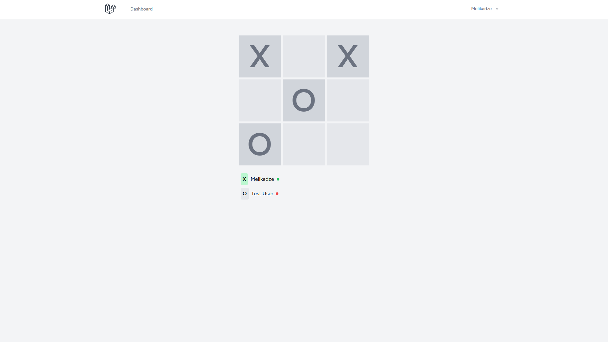

## Online tic-tac-toe game

This is a simple online tic-tac-toe game built with Laravel and Vue.js.

### Features

- Multiplayer game
- Real-time updates
- User authentication

### Installation

1. Clone the repository
2. Run `composer install`
3. Run `php artisan migrate`
4. Run `php artisan serve`
5. Run `npm run dev`
6. Run `php artisan:reverb start`
7. Run `php artisan:queue listen`
 
### Screenshots

